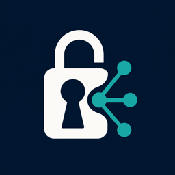
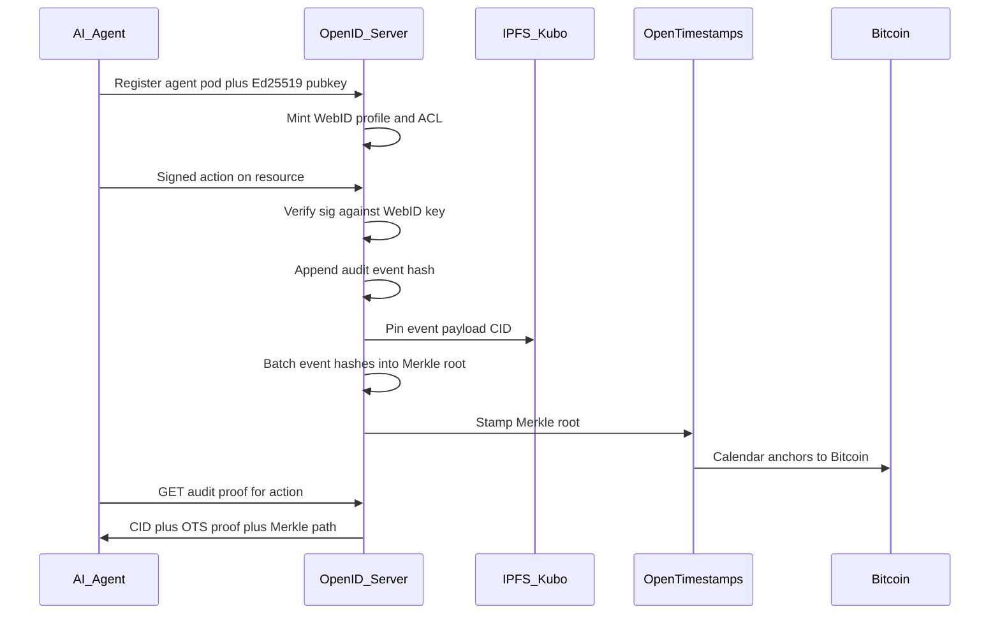

<p align="center">
  
</p>

<h1 align="center">OpenID</h1>

<p align="center">
  <strong>Solid Protocol identity for AI agents</strong><br/>
  WebID pods · WAC access control · IPFS content addressing · Bitcoin-anchored audit via OpenTimestamps
</p>

<p align="center">
  <a href="https://github.com/Hewlbern/openID"></a>
  <a href="LICENSE"></a>
  <a href="#quick-start"></a>
</p>

---

OpenID is a [Solid Protocol](https://solidproject.org/TR/protocol) server written in Go. It gives each AI agent a **WebID**, a **pod**, and a **tamper-evident audit trail**: every mutating action is hashed, pinned to IPFS, Merkle-batched, and stamped with [OpenTimestamps](https://opentimestamps.org/) (Bitcoin calendar attestation).

> Not the same as [OpenID Connect](https://openid.net/connect/) the SSO standard — though this server also exposes OIDC discovery and client-credentials for machine agents. Here **OpenID** means *open identity* for agents on Solid.

## Why

| Need | What OpenID provides |
|------|----------------------|
| Agent identity | Solid WebID + Ed25519 key + optional `did:key` |
| Private data store | LDP pod with WAC ACLs |
| Interop | HTTP Linked Data (Turtle, SPARQL UPDATE, N3-Patch) |
| Proof of action | IPFS CID + Merkle path + OTS Bitcoin calendar proof |
| Machine auth | Bearer JWT, DPoP, client-credentials, agent signatures |

## Quick start

```bash
git clone https://github.com/Hewlbern/openID.git
cd openID
go run ./cmd/server -port 3000 -storage ./data
```

Open the Solid server dashboard (this is the server console, not the marketing landing):

```
http://localhost:3000/
```

Handle-claim landing (separate product page):

```
http://localhost:3000/welcome
```

Health check:

```bash
curl -s http://localhost:3000/health
# {"status":"ok"}
```

MCP (Grok Bot / Cursor / Gemini Spark): `http://localhost:3000/mcp` — also stdio via `go run ./cmd/mcp` with `OPENID_BASE_URL`.

```bash
curl -s http://localhost:3000/mcp
# {"open":true,"dashboard":"...","mcp":".../mcp", ...}
```

Claim a handle:

```bash
curl -s http://localhost:3000/idp/handles/ada
curl -s -X POST http://localhost:3000/idp/register \
  -H 'Content-Type: application/json' \
  -d '{"handle":"ada","password":"testpass123","name":"Ada"}'
# Public page: http://localhost:3000/i/ada
# Passport UI: http://localhost:3000/app
```

## Save and share Gemini Spark conversations

OpenID already is a Solid server. Spark talks to this pod’s MCP and writes the thread into the signed-in human’s pod at `{pod}/conversations/spark/{id}.json` (plus Turtle metadata). Every save, share, and revoke is an audited LDP write.

Google does **not** publish a Gemini bulk export API. If a `g.co/gemini/share/…` link is not publicly fetchable, paste the transcript.

1. Run the server: `go run ./cmd/server -port 3000 -storage ./data`
2. Register or log in, then open the passport at `/app`.
3. Click **Save**, paste a Spark-style transcript (`**User:**` / `**Gemini:**`) or a public Gemini share URL.
4. Click **Share**, copy `/share/c/{id}`. Open that URL logged out — it is read-only until you revoke it.
5. Connect Gemini Spark’s custom MCP to `https://<origin>/mcp` (local: `http://localhost:3000/mcp`). Authenticate with a Bearer token from `openid_login` / `POST /idp/login`, or pass `token` on each tool.

MCP tools: `spark_save_conversation`, `spark_list_conversations`, `spark_get_conversation`, `spark_share_conversation`, `spark_unshare_conversation`.

```bash
# after login
curl -s -X POST http://localhost:3000/conversations \
  -H "Authorization: Bearer $TOKEN" -H 'Content-Type: application/json' \
  -d '{"title":"Spark","messages":[{"role":"user","text":"hi"},{"role":"assistant","text":"hello"}]}'
```

## Hosted deploy

The Solid server is a long-lived Go process with a volume. The marketing / passport UI is on Vercel and **same-origin proxies** `/idp`, `/conversations`, `/share`, `/mcp`, and pod paths to Railway so register/login/session work in the browser (Bearer in `localStorage` plus an HttpOnly `solid-session` cookie). Do not point the browser at a different API origin unless you only use Bearer tokens.

| Role | URL |
|------|-----|
| Passport / marketing | https://identity-two-plum.vercel.app |
| Solid pod (Railway) | https://pod-production-ebe1.up.railway.app |

**Create an ID and log in (about a minute)**

1. Open https://identity-two-plum.vercel.app
2. Claim a handle + password (or **Sign in**).
3. You land on `/app`. Your WebID is shown on the account pane (`https://pod-production-ebe1.up.railway.app/{handle}/profile/card#me`).
4. **Save** a Spark transcript, **Share**, open the link in a private window.
5. Sign out, then sign back in with the same handle + password.

**Environment**

| Variable | Where | Meaning |
|----------|--------|---------|
| `SOLID_BASE_URL` | Railway / `cmd/server` | Must be the public pod origin (`https://pod-production-ebe1.up.railway.app`). WebIDs are minted from this. |
| `SOLID_TOKEN_SECRET` | Railway | JWT HMAC secret. Required in production. |
| `SOLID_STORAGE_PATH` | Railway | Persistent volume (e.g. `/data`). |
| `OPENID_POD` | Vercel build | Pod origin the site proxies to. Defaults to the Railway URL above. |
| `OPENID_API` | Vercel build | Leave empty so the browser stays on the Vercel origin. |

```bash
# frontend (repo root or frontend/)
OPENID_POD=https://pod-production-ebe1.up.railway.app vercel --prod
```

Redeploy the Railway Go service from the same git revision so `/conversations` and `/share/c/` exist on the pod. The Vercel rewrite cannot invent those routes.

**Railway (pod origin)**

1. Create a new Railway project from this repo (`Dockerfile` + `railway.toml`).
2. Attach a volume at `/data`.
3. Set `SOLID_STORAGE_PATH=/data`, a real `SOLID_TOKEN_SECRET`, and `SOLID_BASE_URL=https://<your-railway-domain>` after the domain exists.
4. Railway injects `PORT`; the binary already reads it.

**Vercel (frontend)**

```bash
cd frontend
OPENID_API=https://<your-railway-domain> vercel --prod
```

The **pod is the product**. Anyone can run the same Docker image — locally, on Railway, or anywhere that can keep a volume. The Vercel site and any future desktop app are optional clients of that origin. They are not required to run a pod.

```bash
# published image, persistent volume, dashboard at http://localhost:3000
docker compose up -d
```

Set `SOLID_BASE_URL` to the URL others will use for WebIDs. To also keep a replica of a handle on another origin (for example Railway):

```bash
SOLID_BASE_URL=http://localhost:3000 \
SOLID_SYNC_PEER=https://pod-production-ebe1.up.railway.app \
SOLID_SYNC_HANDLE=mike \
SOLID_SYNC_PASSWORD=… \
docker compose up -d
```

Optional Kubo (audit CIDs): `docker compose --profile ipfs up -d` and `IPFS_API=http://ipfs:5001`.
Other operators can run the same split: one SolidGo instance (Railway/Docker) plus a Vercel project whose `OPENID_API` points at their server.

## 60-second agent demo

```bash
# 1. Register an agent → WebID, keypair, Bearer token
curl -s -X POST http://localhost:3000/agents \
  -H 'Content-Type: application/json' \
  -d '{"name":"Atlas"}' | jq

# 2. Write to the agent pod (audited)
TOKEN=<token from step 1>
POD=agent-<id>/
curl -s -X PUT "http://localhost:3000/${POD}inbox/task.json" \
  -H "Authorization: Bearer $TOKEN" \
  -H 'Content-Type: application/json' \
  -d '{"task":"summarize"}'

# 3. Anchor audit batch (Merkle root → OpenTimestamps)
curl -s -X POST http://localhost:3000/audit/flush | jq

# 4. Verify an event
curl -s "http://localhost:3000/audit/events/<event-id>/verify" | jq
```

### Agent request signing

Instead of a Bearer token, agents can sign each request:

| Header | Value |
|--------|--------|
| `X-Agent-WebID` | Agent WebID |
| `X-Agent-Public-Key` | base64url Ed25519 public key |
| `X-Agent-Timestamp` | Unix seconds |
| `X-Agent-Signature` | Ed25519 over `METHOD\|PATH\|TIMESTAMP\|WEBID` |

## Architecture



When OTS calendars are unreachable, a **pending local proof** is stored and can be upgraded later via verify.

## API surface

### Identity

| Endpoint | Purpose |
|----------|---------|
| `GET/POST /mcp` | MCP for Grok Bot and Gemini Spark (open, tools/list, tools/call) |
| `GET/POST /conversations` | Save / list Spark conversations (Bearer) |
| `POST /conversations/{id}/share` | Mint `/share/c/{id}` and set WAC |
| `POST /conversations/{id}/unshare` | Revoke share (404/401 afterwards) |
| `GET /share/c/{id}` | Public read-only conversation page |
| `POST /agents` | Register AI agent (pod + WebID + keys) |
| `GET /agents` | List agents |
| `POST /idp/register` | Human account + pod |
| `POST /idp/login` | Password login |
| `POST /idp/client-credentials` | Machine client id/secret |
| `POST /oauth/token` | Token endpoint |
| `GET /.well-known/openid-configuration` | OIDC discovery |
| `GET /.well-known/solid` | Solid storage description |

### Solid LDP

`GET` `HEAD` `PUT` `POST` `PATCH` `DELETE` `OPTIONS` on resource paths.

- Containers end with `/` and return Turtle `ldp:contains`
- Create containers with `Link: <http://www.w3.org/ns/ldp#BasicContainer>; rel="type"`
- Patch with `Content-Type: application/sparql-update` or `text/n3`
- ACLs at `{resource}.acl` or `{container}/.acl`

### Audit

| Endpoint | Purpose |
|----------|---------|
| `GET /audit/events/` | List audit events |
| `GET /audit/events/{id}` | Event detail (includes IPFS CID) |
| `GET /audit/events/{id}/verify` | Hash + Merkle + OTS check |
| `POST /audit/flush` | Force Merkle batch + OTS stamp |
| `GET /audit/batches/{id}` | Batch + Merkle paths + OTS proof |

### Notifications

| Endpoint | Purpose |
|----------|---------|
| `GET /notifications/websocket?topic=` | WebSocket activity stream |
| `GET /notifications/stream?topic=` | SSE activity stream |

## Configuration

| Flag / env | Default | Meaning |
|------------|---------|---------|
| `-port` / `SOLID_PORT` | `3000` | Listen port |
| `-storage` / `SOLID_STORAGE_PATH` | `./data` | File storage root |
| `-base-url` / `SOLID_BASE_URL` | `http://localhost:{port}` | Public base URL for WebIDs |
| `-ipfs-api` / `IPFS_API` | _(empty = offline CIDs)_ | Kubo HTTP API |
| `SOLID_TOKEN_SECRET` | dev default | JWT HMAC secret |
| `AUDIT_BATCH_INTERVAL` | `30s` | Merkle/OTS batch period |
| `OTS_CALENDAR` | public OTS calendars | Comma-separated calendar URLs |

## Develop

```bash
go test ./internal/... ./test/...
go build -o openid ./cmd/server
docker compose --profile test run --rm solid-tests
```

### Functional tests (live HTTP)

```bash
go build -o /tmp/openid ./cmd/server
/tmp/openid -port 3460 -storage /tmp/openid-data -base-url http://localhost:3460 &
BASE_URL=http://localhost:3460 ./test/functional/run.sh
```

Covers health, OIDC discovery, register/login, LDP CRUD, ETags/conditions, SPARQL + N3 patch, WAC, client-credentials, AI agent + Ed25519 signatures, audit Merkle/OTS verify, SSE notifications, CORS, and the grokbot MCP (HTTP + stdio).

```bash
BASE_URL=http://localhost:3460 ./test/functional/mcp.sh
```

Grok Bot / Cursor load `.cursor/mcp.json` and `.mcp.json` in this repo (`url: http://127.0.0.1:4000/mcp` when the local pod is on port 4000). Gemini Spark should use `https://<origin>/mcp` with a Bearer token from `/idp/login`.

## Layout

```
assets/openid-icon.png    brand mark
cmd/server/               entrypoint
internal/solid/           LDP HTTP handler
internal/resourcestore/   containers, ETags, metadata
internal/wac/             Web Access Control
internal/authn/           Bearer / DPoP / agent signatures
internal/identityapi/     accounts, OIDC, client credentials
internal/agent/           AI agent registry
internal/audit/           hash chain + Merkle batches
internal/ipfs/            Kubo client (+ offline fallback)
internal/ots/             OpenTimestamps client
internal/notify/          WebSocket + SSE
internal/openidmcp/       MCP stdio + HTTP for Grok Bot and Gemini Spark
internal/conversations/   Spark save / list / share (pod + WAC)
internal/rdf/             Turtle / SPARQL UPDATE / N3-Patch
cmd/mcp/                  stdio MCP entrypoint
```

## License

Apache-2.0 — see [LICENSE](LICENSE).

Author: [Michael Holborn](https://www.linkedin.com/in/michaelholborn/)
